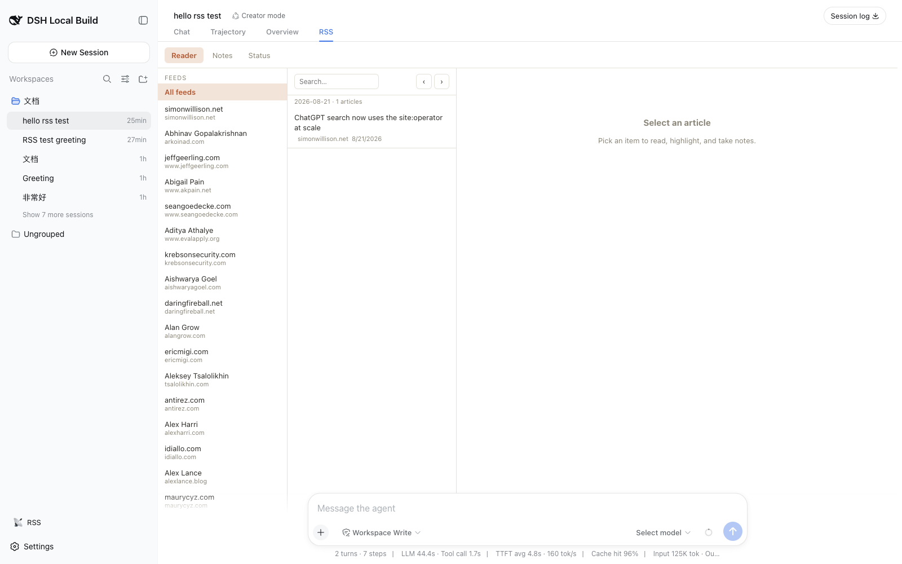
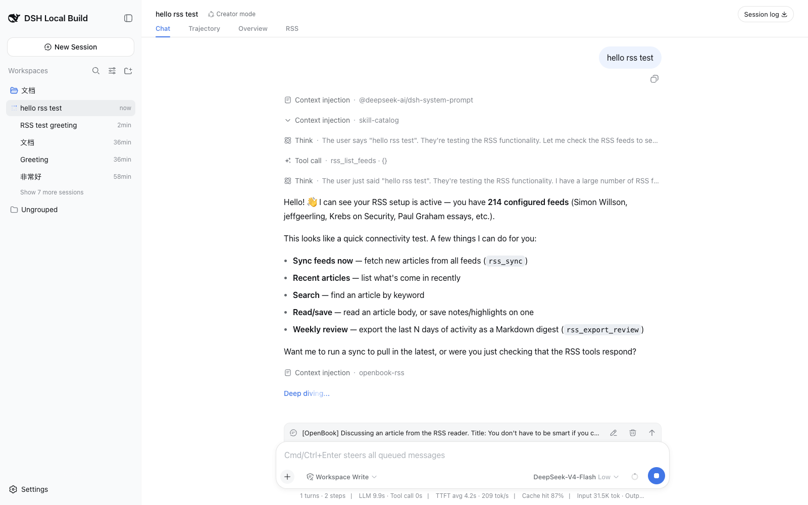

# OpenBook RSS Reader — a DeepSeek Harness UI plugin

[中文](README.zh.md)

OpenBook is a local-first RSS reader and knowledge collector, rebuilt as a
[DeepSeek Harness](https://github.com/deepseek-ai/deepseek-harness) (`dsh`)
plugin. Everything — feed sync, article materialization, notes/highlights,
activity timeline, chat commands, and the three-column reading UI — runs
inside the dsh plugin runtime as native Cordis services.

| | |
|---|---|
| Package | `@openbook/dsh-rss-reader` |
| Host runtime | Node `^22.19 \|\| >=24`, dsh `>=0.1.0-rc.8` |
| License | MIT |



*One click on the sidebar 📡 shortcut lands straight on the RSS tab; discussing
an article pushes it into the conversation and switches back to Chat.*

## What it gives you

A single RSS surface: the **`RSS` tab in the session view ring** (a
`conversation.view` entry). It is a three-column reader with a feed sidebar,
per-day article queue with date navigation, full-text reading, favorites, and
note-taking, plus **Notes** (activity-driven waterfall) and **Status** (sync
statistics, activity stream) tabs. A lightweight **sidebar 📡 shortcut** jumps
straight to the RSS tab — opening a non-blank session first when needed — so
there is one reader with one obvious way in, and no competing docked panel.

Reading and chatting work together:

- **Ambient awareness** — opening an article injects it into the session's
  agent context (`agent.inject`), so the model knows what you are reading
  without a chat round-trip.
- **Discuss this article** — quick actions (总结 / 翻译 / 提取要点) plus a
  free-form question push the article into the conversation (`agent.followup`),
  then the view automatically switches back to the **Chat** tab so you see the
  reply. Selecting text first attaches it as a highlighted passage.
- **Sync nodes** — each sync run renders as one compact card in the chat flow
  (`rss/sync` conversation node), driven by durable session events.



The same functionality is available to the agent:

- **Tools** the model can call: `rss_list_feeds`, `rss_sync`, `rss_search`,
  `rss_read_article`, `rss_materialize`, `rss_save_note`,
  `rss_export_review`, plus the agent-readable `book_index`, `book_recent`,
  `book_article`, `book_search`.
- **Chat commands** (the legacy `cli.js` surface, mapped 1:1): `/feeds`,
  `/read`, `/search`, `/recent`, `/notes`, `/favorites`, `/stats`, `/open`,
  `/materialize`, `/sync`, `/export-review`, `/review`, `/activity`, `/book`,
  `/doctor`.

## Installation

```sh
# from npm (once published)
dsh plugin --profile web add @openbook/dsh-rss-reader

# or straight from this repository
git clone https://github.com/rocklau/dsh-rss-reader.git
dsh plugin --profile web add ./dsh-rss-reader

# then just start the web UI
dsh web
```

`dsh plugin add` installs the package into the `web` profile and, because the
package declares `dsh.bundle`, adds it to the profile's bundle list
automatically. No other configuration is needed.

### Development (no install)

```sh
npm install
npm run build          # esbuild bundles + tsc declarations
dsh web --patch ./cordis.patch.yml
```

The overlay in `cordis.patch.yml` inserts the plugin into the running web
profile. The client half (the `RSS` view tab) is picked up automatically from
the package's `dsh.client` declaration.

### Tests

```sh
npm test               # unit suites (node --test)
npm run test:e2e       # real-composition e2e; needs DSH_SOURCE_DIR
```

The e2e boots a real `dsh web` composition and invokes the `rssApi` endpoints
over the same transport the browser uses. Point it at a DeepSeek Harness
source checkout:

```sh
DSH_SOURCE_DIR=/path/to/deepseek-harness npm run test:e2e
```

## Configuration

All options are validated at load and overridable from a patch overlay:

```yaml
# cordis.patch.yml
- id: openbook-rss
  config:
    dataDir: ~/.dsh/openbook-rss/v1     # sqlite + markdown + notes + index.json
    allowPrivateFeeds: false            # SSRF guard: block DNS private ranges
    startupSync: true                   # warm sync at boot
    startupSyncLimit: 50
    feedMinSyncIntervalMs: 120000
    feedHeadCheck: true                 # HEAD validator before conditional GET
    feedHeadTimeoutMs: 3000
    fetchConcurrency: 4
    fetchIntervalCap: 10                # requests per rate window
    fetchIntervalMs: 1000
    defaultFeeds: [{ url: "...", name: "..." }]
    opmlFiles: []                       # absolute OPML paths imported at boot
```

## Data model

The plugin keeps OpenBook's three-state local persistence under `dataDir`:

- `openbook.db` — SQLite (feeds, fetch cache, sync state/log, articles,
  article state, notes, activity log), WAL mode, migrations in
  `src/db/schema.ts`.
- `articles/YYYY/MM/*.md` — materialized articles with YAML front matter
  (`title`, `url`, `feed_url`, `published_at`, `fetched_at`, `source`).
- `notes/YYYY/MM/*.md` — notes/highlights keyed by `article_id`.
- `index.json` — compact grep-friendly feed/article index.

Article ids are `sha256(feedUrl::guid|link|title)` (`stableId`), so rows are
idempotent across syncs. Materialization is deduplicated by normalized URL
and serialized with in-flight joins. Image assets are localized into
`<article>-assets/` with MD5-hash dedupe (`downloadResources`).

## Fetch pipeline

Memory cache → per-feed min-interval skip → HEAD validators (ETag /
Last-Modified) → conditional GET (304) → SQLite BLOB fallback. All requests
run through a shared rate-limited queue with exponential-backoff retry on
429/5xx; feed URLs are SSRF-checked at the DNS level (private ranges blocked
unless `allowPrivateFeeds: true`).

## Development

```sh
npm run typecheck       # host + client faces
npm test                # build + node --test (no network required)
```

Layout:

```
src/        host side (Node) — plugin entry, Cordis services, tools, commands, db, rss engine
client/     browser side (React) — reading view, notes/status tabs, sync conversation node
cordis.patch.yml   bundle overlay for dsh web --patch
legacy/     the pre-refactor Express codebase, archived
```

The host entry (`src/index.ts`) constructs six Cordis services: `rssStore`
(database + repositories + fetch queue), `rssFeed` (feeds + reader engine),
`rssArticle` (queries/materialization/state/notes), `rssActivity` (timeline +
review export), `rssSync` (warm sync state machine), and `rssApi` (the
Typert Remote surface the client calls). The client mounts the matching
`TypertRemoteContribution` (hand-written in `client/remote.ts`), registers
the `conversation.view` tab, and registers the `rss/sync` conversation node
with its chat renderer.

## Mapping from the legacy OpenBook

| Legacy | Plugin |
|---|---|
| Express server + routes | Cordis services + Typert Remote API |
| `public/` three-column UI | `conversation.view` tab (React) |
| `cli.js` commands | chat slash commands (`/feeds`, `/book`, `/export-review`, …) |
| `book * --json` | `book_*` tools + `/book` |
| RSSReader + queue + cache | `RssReader` service (same layered cache) |
| `data/` layout | same layout under `dataDir` (default `~/.dsh/openbook-rss/v1`) |
