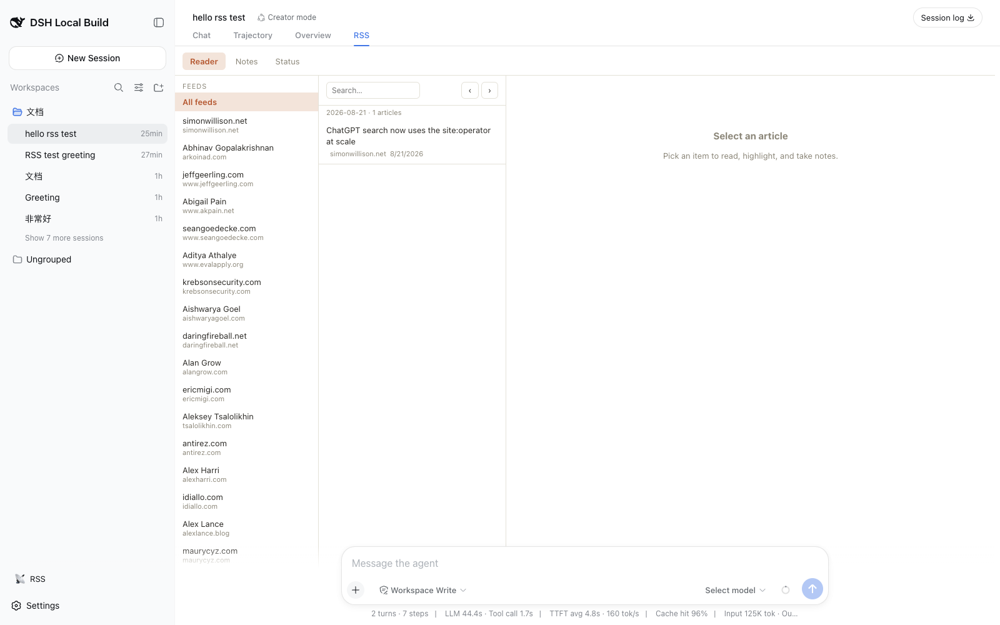
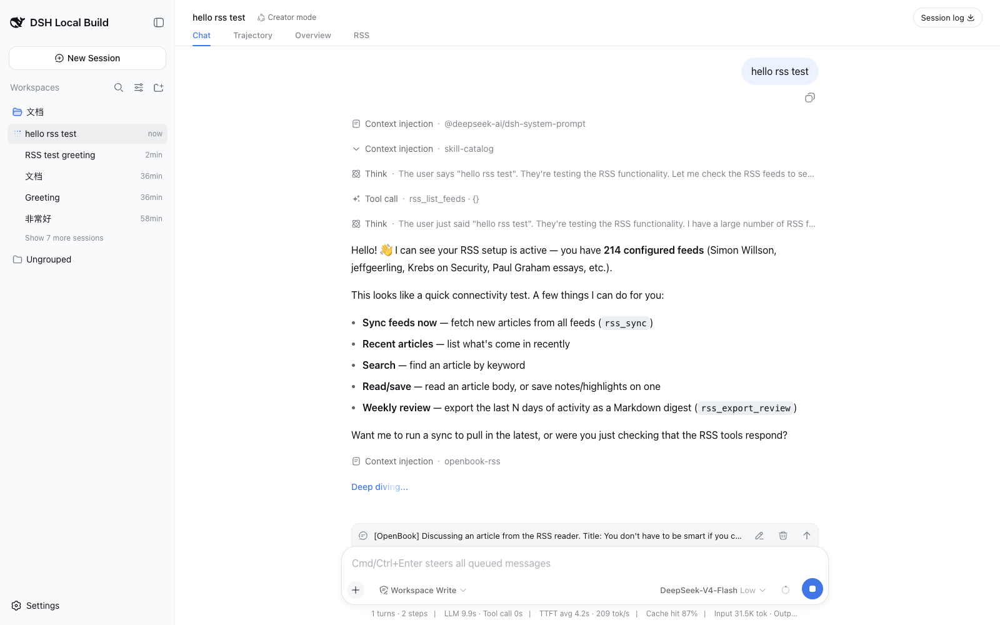

# OpenBook RSS Reader — a DeepSeek Harness UI plugin

[中文](README.zh.md)

OpenBook is a local-first RSS reader and knowledge collector, rebuilt as a
[DeepSeek Harness](https://github.com/deepseek-ai/deepseek-harness) (`dsh`)
plugin. Everything — feed sync, article materialization, notes/highlights,
activity timeline, chat commands, and the three-column reading UI — runs
inside the dsh plugin runtime as native Cordis services.

| | |
|---|---|
| Package | `@openbook/dsh-rss-reader` |
| Host runtime | Node `^22.19 \|\| >=24`, Harness `0.2.0-rc.2`, Cordis `4.0.4`, Schemastery `3.18.4` |
| License | MIT |



*One click on the sidebar 📡 shortcut lands straight on the RSS tab; discussing
an article pushes it into the conversation and switches back to Chat.*

## What it gives you

A single RSS surface: the **`RSS` tab in the session view ring** (a
`conversation.view` entry). It is a three-column reader with a feed sidebar,
per-day article queue with date navigation, full-text reading, favorites, and
note-taking, plus **Notes** (activity-driven waterfall) and **Status** (sync
statistics, activity stream) tabs. A lightweight **sidebar 📡 shortcut** jumps
straight to the RSS tab — opening a non-blank session first when needed — so
there is one reader with one obvious way in, and no competing docked panel.

Reading and chatting work together:

- **Ambient awareness** — opening an article injects it into the session's
  agent context (`agent.inject`), so the model knows what you are reading
  without a chat round-trip.
- **Discuss this article** — quick actions (总结 / 翻译 / 提取要点) plus a
  free-form question push the article into the conversation (`agent.followup`),
  then the view automatically switches back to the **Chat** tab so you see the
  reply. Selecting text first attaches it as a highlighted passage.
- **Sync status** — the Status tab shows live sync results. The `rss/sync` renderer can display previously loaded RSS events; current sync runs do not append custom telemetry to Session logs.



The same functionality is available to the agent:

- **Tools** the model can call: `rss_list_feeds`, `rss_sync`, `rss_search`,
  `rss_read_article`, `rss_materialize`, `rss_save_note`,
  `rss_export_review`, plus the agent-readable `book_index`, `book_recent`,
  `book_article`, `book_search`.
- **Chat commands** (the legacy `cli.js` surface, mapped 1:1): `/feeds`,
  `/read`, `/search`, `/recent`, `/notes`, `/favorites`, `/stats`, `/open`,
  `/materialize`, `/sync`, `/export-review`, `/review`, `/activity`, `/book`,
  `/doctor`.

## Installation

### Build a local bundle

This checkout targets the current local Harness, not the old published tarballs. Place the repositories at `ai/deepseek-harness` and `ai/dsh-plugins/dsh-rss-reader`; the development dependencies link to the built Harness libraries. Build the Harness first using its own development instructions.

```sh
pnpm install --no-frozen-lockfile
pnpm typecheck
pnpm build
pnpm pack
```

The tarball contains the host/client runtime, declarations, and `cordis.patch.yml`. Its exact peer versions require Harness `0.2.0-rc.2`, Cordis `4.0.4`, and Schemastery `3.18.4`; it does not bundle an older Harness. These runtime peers are optional for package-manager resolution so installation does not automatically add a second framework; the active Harness must provide them. The plugin's private dependencies remain normal dependencies. The browser entry is `lib/client.js`, with Session APIs from `dsh-api-session-controller/client`, node assembly from `ctx.uiConversation`, and Session selection from `ctx.uiSession`/`ctx.uiWorkspace`.

For Desktop development, open **Plugins** in the running application, install `openbook-dsh-rss-reader-0.1.0-rc.2.tgz`, enable the bundle, and restart Desktop when requested. Open a non-blank conversation and select **RSS**, or use the sidebar RSS shortcut. Installing into a CLI Web profile does not install into Desktop's reserved profile. Reading controls do not require a model call; article context and discussion require a live Agent.

The Host resolver must preserve complete npm specifiers such as `punycode/`, which `jsdom` requests through `tr46`. If activation fails with `createRequire.resolve.paths ... not iterable`, the Harness resolver has treated the npm request as the Node builtin `punycode`. Use a Harness checkout containing the [resolver fix](https://github.com/rocklau/deepseek-harness/commit/966d0b19621619c57e8f9ed578e82ee6a1b8b9b2) before enabling RSS; the package's peer version alone does not verify that fix. The fix is published in the `rocklau/deepseek-harness` fork on `fix/preserve-npm-subpath-resolution`, not merged into the upstream repository.

### Tests

```sh
pnpm test              # build + node --test; isolated project-local fixtures
pnpm test:e2e          # read-only installed-host checks; skips without DSH_E2E_BASE
```

`test/current-harness.test.mjs` exercises the actual current Gateway, tool/command/Typert registries, identified Agent messages, and the built browser factory. The optional e2e uses `DSH_E2E_BASE` for an already-running host and `DSH_E2E_COOKIE` when authentication requires it; it never starts or restarts an application.

## Configuration

All options are validated at load and overridable from a patch overlay:

```yaml
# cordis.patch.yml
- id: openbook-rss
  config:
    dataDir: /absolute/existing/openbook-rss/v1 # preserve your existing data root
    allowPrivateFeeds: false            # SSRF guard: block DNS private ranges
    startupSync: true                   # warm sync at boot
    startupSyncLimit: 50
    feedMinSyncIntervalMs: 120000
    feedHeadCheck: true                 # HEAD validator before conditional GET
    feedHeadTimeoutMs: 3000
    fetchConcurrency: 4
    fetchIntervalCap: 10                # requests per rate window
    fetchIntervalMs: 1000
    defaultFeeds: [{ url: "...", name: "..." }]
    opmlFiles: []                       # absolute OPML paths imported at boot
```

The default `dataDir` is `$DSH_HOME/openbook-rss/v1` as resolved by Harness home paths. Supply an absolute path when overriding it; the plugin does not expand `~`. Keep the same path to preserve SQLite, articles, notes, and indexes. SQLite schema generations in `src/db/schema.ts` are unchanged. `defaultFeeds: []` suppresses initial default-feed seeding; it never removes stored feeds.

Reading context and discussion require an already-live Agent. Missing live Sessions return `{ ok: false, reason: 'session not found' }`; missing articles return `article not found`. RPC schemas reject invalid inputs before service execution. Failed feed/article fetches are reported through sync status or operation errors; private-network feeds require an explicit `allowPrivateFeeds: true`. The RSS tab requires a non-blank Session; the sidebar shortcut selects an existing non-blank Session when available.

Do not use the legacy `scripts/heal-openbook-rss-logs.mjs` to rewrite Session files. It refuses execution without changing files because committed Session generations are immutable. Repairing historical non-ignorable RSS events requires a Harness-owned migration; this plugin does not repair or delete user Session data.

## Data model

The plugin keeps OpenBook's three-state local persistence under `dataDir`:

- `openbook.db` — SQLite (feeds, fetch cache, sync state/log, articles,
  article state, notes, activity log), WAL mode, migrations in
  `src/db/schema.ts`.
- `articles/YYYY/MM/*.md` — materialized articles with YAML front matter
  (`title`, `url`, `feed_url`, `published_at`, `fetched_at`, `source`).
- `notes/YYYY/MM/*.md` — notes/highlights keyed by `article_id`.
- `index.json` — compact grep-friendly feed/article index.

Article ids are `sha256(feedUrl::guid|link|title)` (`stableId`), so rows are
idempotent across syncs. Materialization is deduplicated by normalized URL
and serialized with in-flight joins. Image assets are localized into
`<article>-assets/` with MD5-hash dedupe (`downloadResources`).

## Fetch pipeline

Memory cache → per-feed min-interval skip → HEAD validators (ETag /
Last-Modified) → conditional GET (304) → SQLite BLOB fallback. All requests
run through a shared rate-limited queue with exponential-backoff retry on
429/5xx; feed URLs are SSRF-checked at the DNS level (private ranges blocked
unless `allowPrivateFeeds: true`).

## Development

```sh
pnpm typecheck          # host + client faces against linked current libraries
pnpm test               # build + node --test (loopback fixtures, no external API)
```

Layout:

```
src/        host side (Node) — plugin entry, Cordis services, tools, commands, db, rss engine
client/     browser side (React) — reading view, notes/status tabs, sync conversation node
cordis.patch.yml   bundle overlay for dsh web --patch
legacy/     the pre-refactor Express codebase, archived
```

The host entry (`src/index.ts`) constructs six Cordis services: `rssStore`
(database + repositories + fetch queue), `rssFeed` (feeds + reader engine),
`rssArticle` (queries/materialization/state/notes), `rssActivity` (timeline +
review export), `rssSync` (warm sync state machine), and `rssApi` (the
Typert Remote surface the client calls). The client mounts the matching
`TypertRemoteContribution` (hand-written in `client/remote.ts`), registers
the `conversation.view` tab, and registers the `rss/sync` conversation node
with its chat renderer.

## Mapping from the legacy OpenBook

| Legacy | Plugin |
|---|---|
| Express server + routes | Cordis services + Typert Remote API |
| `public/` three-column UI | `conversation.view` tab (React) |
| `cli.js` commands | chat slash commands (`/feeds`, `/book`, `/export-review`, …) |
| `book * --json` | `book_*` tools + `/book` |
| RSSReader + queue + cache | `RssReader` service (same layered cache) |
| `data/` layout | same layout under the configured `dataDir`; see [Configuration](#configuration) |
